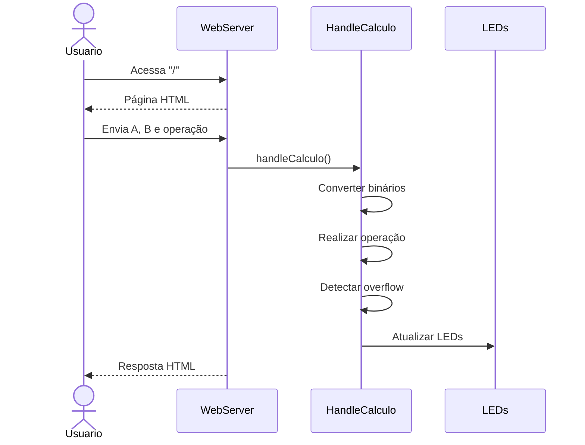

## Diagrama de Sequência

```mermaid
sequenceDiagram
    actor Usuario

    participant WebServer
    participant HandleCalculo
    participant LEDs

    Usuario->>WebServer: Acessa "/"
    WebServer-->>Usuario: Página HTML

    Usuario->>WebServer: Envia A, B e operação

    WebServer->>HandleCalculo: handleCalculo()

    HandleCalculo->>HandleCalculo: Converter binários
    HandleCalculo->>HandleCalculo: Realizar operação
    HandleCalculo->>HandleCalculo: Detectar overflow

    HandleCalculo->>LEDs: Atualizar LEDs

    WebServer-->>Usuario: Resposta HTML
```