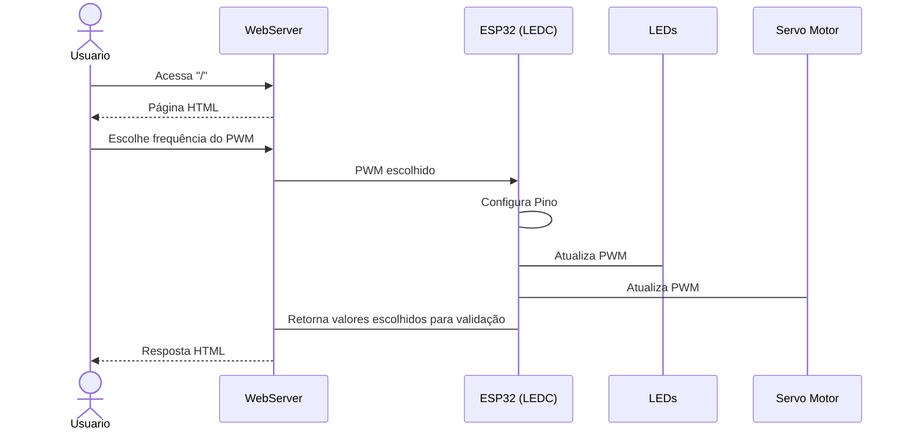

## Diagrama de Sequência

```mermaid
sequenceDiagram
    actor Usuario

    participant WebServer
    participant ESP32 (LEDC)
    participant LEDs
    participant Servo Motor

    Usuario->>WebServer: Acessa "/"
    WebServer-->>Usuario: Página HTML

    Usuario->>WebServer: Escolhe frequência do PWM

    WebServer->>ESP32 (LEDC): PWM escolhido
    
    ESP32 (LEDC)->ESP32 (LEDC): Configura Pino

    ESP32 (LEDC)->LEDs: Atualiza PWM
    
    ESP32 (LEDC)->Servo Motor: Atualiza PWM
    
    ESP32 (LEDC)->WebServer: Retorna valores escolhidos para validação

    WebServer-->>Usuario: Resposta HTML
```