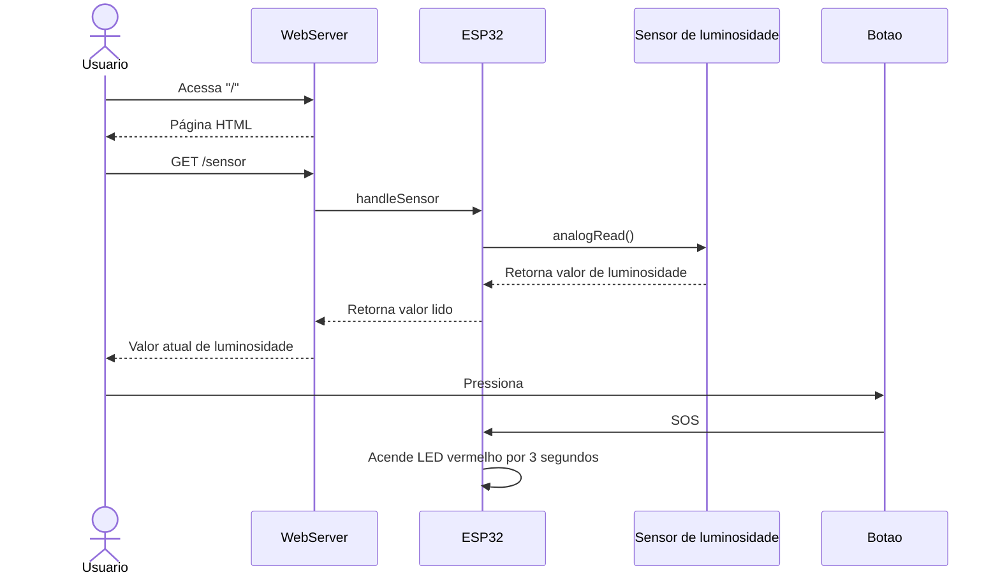

## Diagrama de Sequência

```mermaid
sequenceDiagram
    actor Usuario

    participant WebServer
    participant ESP32 
    participant Sensor de luminosidade

    Usuario->>WebServer: Acessa "/"
    WebServer-->>Usuario: Página HTML
Usuario ->>WebServer: GET /sensor

    WebServer->>ESP32: handleSensor

    ESP32->>Sensor de luminosidade: analogRead()
    Sensor de luminosidade-->>ESP32: Retorna valor de luminosidade
    ESP32-->>WebServer: Retorna valor lido

WebServer-->>Usuario:Valor atual de luminosidade

Usuario->>Botao:Pressiona
Botao->>ESP32:SOS
ESP32->>ESP32:Acende LED vermelho por 3 segundos
```
