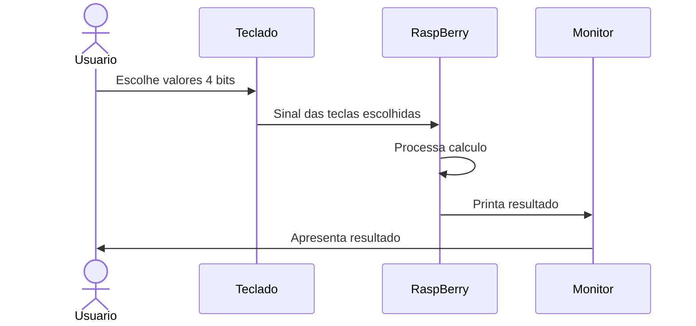

# Experimento 6 — códigos

Esta pasta contém somente as implementações e as instruções de execução.

## 1. Calculadora no Raspberry Pi 3

No terminal do Raspberry Pi:

```sh
cd Experimento6/raspberry_pi
make calculadora
./calculadora
```

A calculadora recebe operandos assinados de quatro bits em complemento de dois.
Por exemplo, `0101` vale 5 e `1110` vale -2. As operações disponíveis são soma,
subtração, multiplicação, divisão e fatorial. Divisão por zero e fatorial de
número negativo geram mensagens de erro, sem executar uma operação inválida.

## 2. Benchmark Raspberry Pi 3 × ESP32-C3

Compile e execute no Raspberry Pi:

```sh
cd Experimento6/raspberry_pi
make benchmark
./benchmark > raspberry_pi.csv
```

Abra `esp32_benchmark/esp32_benchmark.ino` na Arduino IDE, selecione a placa
ESP32-C3, grave o programa e salve a saída do monitor serial em
`esp32_c3.csv`. Use 115200 bit/s.

Os dois programas usam:

- larguras de 4, 8, 16, 32 e 64 bits;
- 30 amostras por operação;
- os mesmos operandos e quantidades de repetições;
- média e desvio-padrão amostral;
- saída CSV em nanossegundos por operação.

Para reduzir a interferência, feche programas desnecessários no Raspberry Pi e
não use Wi-Fi, servidor web ou impressão serial dentro do intervalo medido.

## 3. Simulação ARM e RISC-V

Os arquivos em `simulacao/` implementam a mesma interface:

| Código | Operação |
|---:|---|
| 0 | soma |
| 1 | subtração |
| 2 | multiplicação |
| 3 | fatorial |
| 4 | divisão |

`ARM.asm` usa ARM A32 para o Cortex-A53 do Raspberry Pi 3.
`RISCV.asm` usa RV32IM, compatível com a arquitetura do ESP32-C3. Cada programa
executa oito casos automaticamente. Ao atingir o laço final, confira no
simulador:

- resultados esperados: `7, -2, -6, 120, 3, 0, 0, 0`;
- status esperados: `0, 0, 0, 0, 0, 1, 3, 4`.

O status 1 representa divisão por zero, 3 representa fatorial negativo e 4
representa overflow. Os vetores se chamam `arm_results`/`arm_status` e
`riscv_results`/`riscv_status`.

## 4. Desafio standalone

O sketch `desafio_standalone/desafio_standalone.ino` usa um ESP32-C3, teclado
matricial 4×4 e LCD I2C 16×2. Bibliotecas necessárias:

- `Keypad`;
- `LiquidCrystal_I2C`.

Comandos do teclado:

- `0` e `1`: entrada dos operandos;
- `A`, `B`, `C`, `D`: soma, subtração, multiplicação e divisão;
- `*`: fatorial;
- `#`: executar ou limpar após um resultado.

Os pinos e o endereço I2C estão declarados no início do sketch e devem ser
ajustados caso a montagem física use outra ligação.


## 5. Diagrama de Sequência


