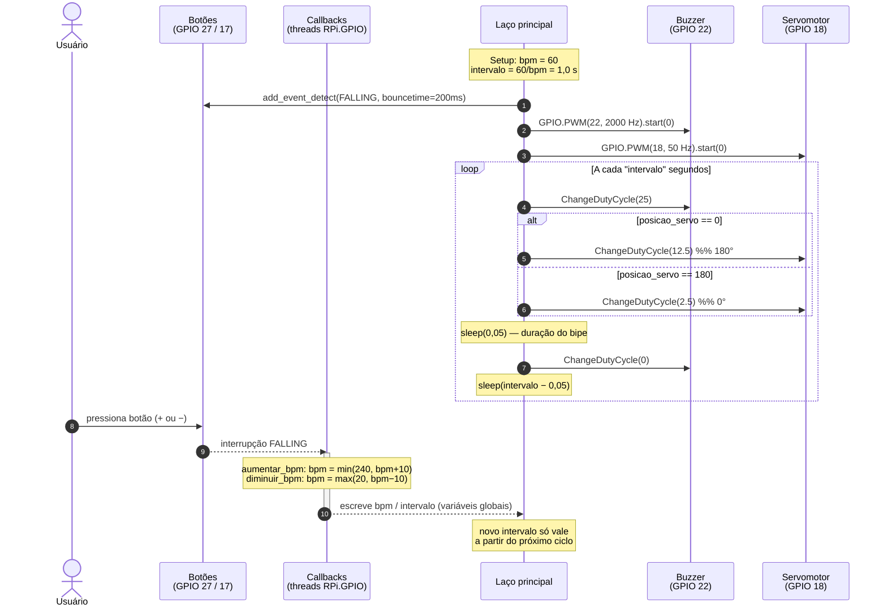

```mermaid
sequenceDiagram
    autonumber
    actor U as Usuário
    participant BTN as Botões<br/>(GPIO 27 / 17)
    participant CB as Callbacks<br/>(threads RPi.GPIO)
    participant MAIN as Laço principal
    participant BUZ as Buzzer<br/>(GPIO 22)
    participant SRV as Servomotor<br/>(GPIO 18)

    Note over MAIN: Setup: bpm = 60<br/>intervalo = 60/bpm = 1,0 s
    MAIN->>BTN: add_event_detect(FALLING, bouncetime=200ms)
    MAIN->>BUZ: GPIO.PWM(22, 2000 Hz).start(0)
    MAIN->>SRV: GPIO.PWM(18, 50 Hz).start(0)

    loop A cada "intervalo" segundos
        MAIN->>BUZ: ChangeDutyCycle(25)
        alt posicao_servo == 0
            MAIN->>SRV: ChangeDutyCycle(12.5)  %% 180°
        else posicao_servo == 180
            MAIN->>SRV: ChangeDutyCycle(2.5)   %% 0°
        end
        Note over MAIN: sleep(0,05) — duração do bipe
        MAIN->>BUZ: ChangeDutyCycle(0)
        Note over MAIN: sleep(intervalo − 0,05)
    end

    U->>BTN: pressiona botão (+ ou −)
    BTN-->>CB: interrupção FALLING
    activate CB
    Note over CB: aumentar_bpm: bpm = min(240, bpm+10)<br/>diminuir_bpm: bpm = max(20, bpm−10)
    CB-->>MAIN: escreve bpm / intervalo (variáveis globais)
    deactivate CB
    Note over MAIN: novo intervalo só vale<br/>a partir do próximo ciclo
```
