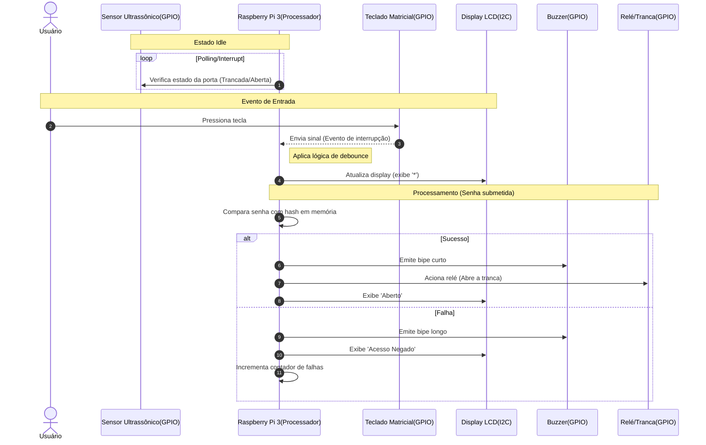

# Experimento 9 — Fechadura Eletrônica (Raspberry Pi 3)

Protótipo de uma **fechadura eletrônica** controlada por um Raspberry Pi 3.
O sistema recebe uma senha por **teclado matricial 4x4**, dá **feedback sonoro**
por um **buzzer**, mostra o estado em um **display LCD 16x2 via I2C**, aciona a
**tranca** (servomotor) e usa um **sensor ultrassônico** para verificar se a
porta está de fato fechada.

Esta pasta contém as implementações **isoladas** de cada componente e a
**integração** completa, seguindo o padrão dos demais experimentos.

## Estrutura

```
Experimento9/
├── Buzzer/               # feedback sonoro (isolado)
│   └── Buzzer.py
├── Teclado/              # teclado matricial 4x4 (isolado)
│   └── Teclado.py
├── LCD_I2C/              # display LCD 16x2 via I2C (isolado)
│   ├── lcd_i2c.py        # driver do LCD (PCF8574 + HD44780)
│   └── Teste_LCD.py      # demonstração do driver
├── Sensor/               # sensor ultrassônico HC-SR04 (isolado)
│   └── SensorUltrassonico.py
├── Tranca_Servo/         # atuador da tranca via servomotor (isolado)
│   └── Tranca_Servo.py
└── Fechadura/            # INTEGRAÇÃO completa
    ├── lcd_i2c.py
    ├── buzzer.py
    ├── teclado.py
    ├── sensor.py
    ├── tranca.py
    └── fechadura.py      # programa principal
```

## Pinagem (numeração BCM)

| Componente             | Pino(s) BCM              | Observação                         |
|------------------------|--------------------------|------------------------------------|
| Buzzer (PWM)           | 12                       | buzzer passivo                     |
| Servomotor (tranca)    | 18                       | PWM 50 Hz                          |
| Teclado — linhas       | 5, 6, 13, 19             | saídas                             |
| Teclado — colunas      | 26, 16, 20, 21           | entradas com pull-up interno       |
| Sensor HC-SR04 — TRIG  | 23                       | saída                              |
| Sensor HC-SR04 — ECHO  | 24                       | **usar divisor de tensão 5V→3,3V** |
| LCD I2C — SDA / SCL     | 2 / 3 (I2C1)             | endereço 0x27 (ou 0x3F)            |

> Todos os módulos usam a mesma numeração **BCM**. Não há conflito de pinos.

## Pré-requisitos no Raspberry Pi

```sh
# Habilitar o barramento I2C
sudo raspi-config      # Interface Options -> I2C -> Enable

# Bibliotecas Python
sudo apt update
sudo apt install -y python3-rpi.gpio python3-smbus i2c-tools
pip3 install smbus2

# Descobrir o endereço do LCD
i2cdetect -y 1
```

## 3. Testes isolados de cada componente

Cada componente pode ser validado separadamente antes da integração:

```sh
cd Experimento9

# Buzzer: alterna bips de tecla, sucesso e erro
python3 Buzzer/Buzzer.py

# Teclado 4x4: imprime a tecla pressionada
python3 Teclado/Teclado.py

# LCD I2C: percorre várias mensagens (ajuste o endereço se necessário)
cd LCD_I2C && python3 Teste_LCD.py && cd ..

# Sensor ultrassônico: imprime distância e estado (ABERTA/FECHADA)
python3 Sensor/SensorUltrassonico.py

# Tranca (servo): alterna entre TRANCADA e DESTRAVADA
python3 Tranca_Servo/Tranca_Servo.py
```

## 4. Integração — executar a fechadura completa

```sh
cd Experimento9/Fechadura
python3 fechadura.py
```

**Uso do teclado:**

| Tecla | Ação                          |
|-------|-------------------------------|
| 0–9   | digita a senha (mostra `*`)   |
| `#`   | confirma a senha              |
| `*`   | apaga/limpa a senha digitada  |
| `A`   | tranca manualmente            |

**Comportamento:**

- **Senha correta** → 2 bips agudos, LCD `Acesso Liberado`, servo destrava,
  contagem regressiva, servo tranca de novo e o sensor confirma o fechamento.
- **Senha incorreta** → bip longo grave, LCD `Acesso Negado` e contador de
  tentativas. Após **3 tentativas** o teclado é **bloqueado por 30 s**.
- **Arrombamento** → se a porta é aberta com a tranca armada, o sensor detecta
  e dispara o alarme sonoro (`!! ALARME !!`).

A senha padrão é **`1234`**. Ela **não** é gravada em texto puro: o código
guarda apenas o **hash SHA-256** (`SENHA_HASH` em `fechadura.py`), conforme o
diagrama de sequência do projeto. Para trocar a senha, gere um novo hash:

```sh
python3 -c "import hashlib; print(hashlib.sha256(b'NOVA_SENHA').hexdigest())"
```

e substitua o valor de `SENHA_HASH`.

## Plano de integração e depuração

**Integração (incremental, de baixo para cima):**

1. Validar cada componente isoladamente (seção 3).
2. Integrar teclado + LCD (entrada e eco visual da senha).
3. Adicionar buzzer (feedback sonoro em cada evento).
4. Adicionar a tranca (servo) reagindo à senha correta.
5. Adicionar o sensor (confirmação de fechamento e detecção de arrombamento).

**Depuração — dicas usadas neste experimento:**

- Confirmar o endereço do LCD com `i2cdetect -y 1` antes de tudo.
- Usar as mensagens `print()` do terminal como *log* paralelo ao LCD.
- Isolar o pino ECHO do HC-SR04 com divisor de tensão para não danificar o GPIO.
- Sempre encerrar com `GPIO.cleanup()` (bloco `finally`) para liberar os pinos.
- Testar o teclado observando repique (debounce) e a espera de soltura da tecla.

## Diagrama de Sequência



