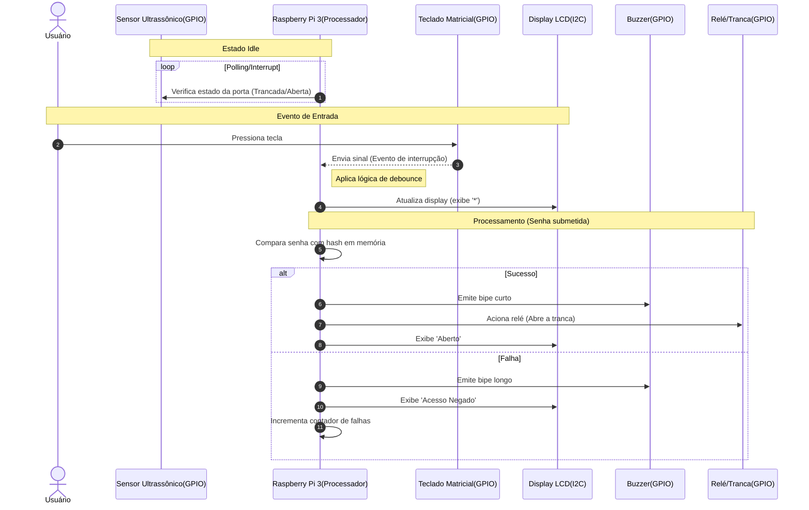

```mermaid
sequenceDiagram
autonumber
actor U as Usuário
participant SENS as Sensor Ultrassônico(GPIO)
participant RPI as Raspberry Pi 3(Processador)
participant TEC as Teclado Matricial(GPIO)
participant LCD as Display LCD(I2C)
participant BUZ as Buzzer(GPIO)
participant REL as Relé/Tranca(GPIO)
Note over RPI, SENS: Estado Idle
loop Polling/Interrupt
    RPI->>SENS: Verifica estado da porta (Trancada/Aberta)
end

Note over U, LCD: Evento de Entrada
U->>TEC: Pressiona tecla
TEC-->>RPI: Envia sinal (Evento de interrupção)
Note right of RPI: Aplica lógica de debounce
RPI->>LCD: Atualiza display (exibe '*')

Note over RPI, REL: Processamento (Senha submetida)
RPI->>RPI: Compara senha com hash em memória

alt Sucesso
    RPI->>BUZ: Emite bipe curto
    RPI->>REL: Aciona relé (Abre a tranca)
    RPI->>LCD: Exibe 'Aberto'
else Falha
    RPI->>BUZ: Emite bipe longo
    RPI->>LCD: Exibe 'Acesso Negado'
    RPI->>RPI: Incrementa contador de falhas
end
```
