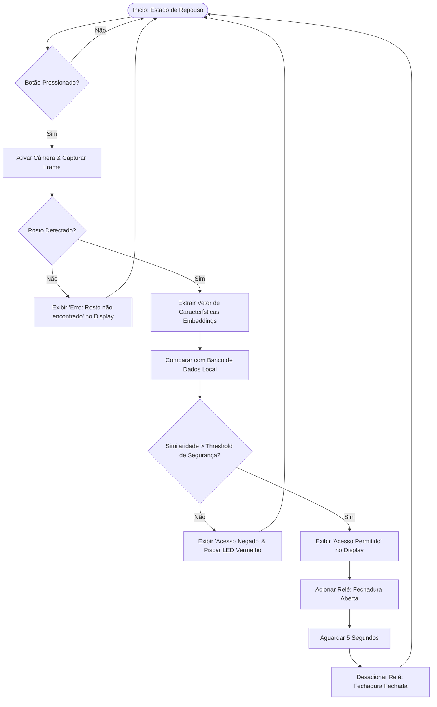
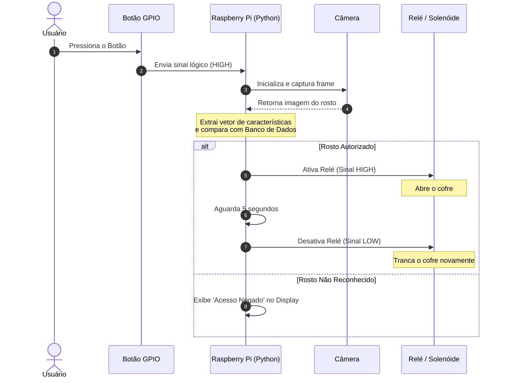

```mermaid
graph TD
    A([Início: Estado de Repouso]) --> B{Botão Pressionado?}
    B -- Não --> A
    B -- Sim --> C[Ativar Câmera & Capturar Frame]
    C --> D{Rosto Detectado?}
    D -- Não --> E[Exibir 'Erro: Rosto não encontrado' no Display]
    E --> A
    D -- Sim --> F[Extrair Vetor de Características Embeddings]
    F --> G[Comparar com Banco de Dados Local]
    G --> H{Similaridade > Threshold de Segurança?}
    H -- Não --> I[Exibir 'Acesso Negado' & Piscar LED Vermelho]
    I --> A
    H -- Sim --> J[Exibir 'Acesso Permitido' no Display]
    J --> K[Acionar Relé: Fechadura Aberta]
    K --> L[Aguardar 5 Segundos]
    L --> M[Desacionar Relé: Fechadura Fechada]
    M --> A
```

```mermaid
sequenceDiagram
    autonumber
    actor Usuario as Usuário
    participant Botao as Botão GPIO
    participant RPi as Raspberry Pi (Python)
    participant Camera as Câmera
    participant Rele as Relé / Solenóide

    Usuario->>Botao: Pressiona o Botão
    Botao->>RPi: Envia sinal lógico (HIGH)
    RPi->>Camera: Inicializa e captura frame
    Camera-->>RPi: Retorna imagem do rosto
    
    Note over RPi: Extrai vetor de características<br>e compara com Banco de Dados
    
    alt Rosto Autorizado
        RPi->>Rele: Ativa Relé (Sinal HIGH)
        Note over Rele: Abre o cofre
        RPi->>RPi: Aguarda 5 segundos
        RPi->>Rele: Desativa Relé (Sinal LOW)
        Note over Rele: Tranca o cofre novamente
    else Rosto Não Reconhecido
        RPi->>RPi: Exibe 'Acesso Negado' no Display
    end
```